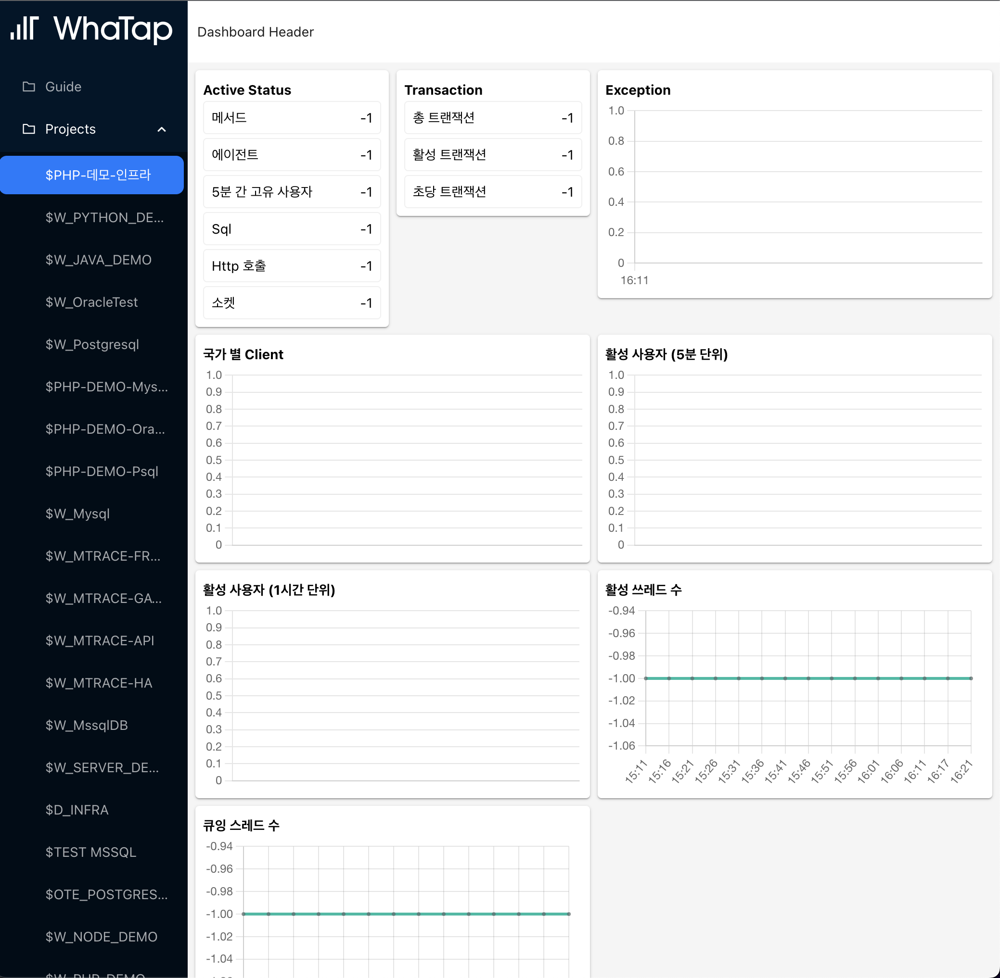

## 프로젝트 개요

* 작성자 : 최준영
* 프로젝트명 : whatap-dashboard
* 목적 : 와탭 Open API를 활용하여 애플리케이션 모니터링을 위한 대시보드 화면을 제작

## 주요 라이브러리

* 기본 컴포넌트 구성을 위한 라이브러리 : antd
* 차트 라이브러리 : chart.js + react-chartjs-2
* 라우트 구조화 : react-router

## 특징

* Sidebar와 Content 영역으로 분리되어있는 대시보드 레이아웃
* Widget 컴포넌트 유형
    * informatics : (지표 이름과 값을 단순 텍스트 형식으로 표시하는 위젯)
    * bar : 막대형 차트
    * line : 선형 차트
* 모든 open api 요청을 5초 주기로 반복하여, 데이터 갱신

## 디렉터리 구조 (src/*)

* api/ : open api 관련
    * open api 연동 규격들에 대한 명세
    * 실제 네트워크 요청 구문을 만들어내기 위한 유틸리티
* components/ : 페이지 레벨 컴포넌트를 제외한 부속 컴포넌트들
    * chart : chart.js 기반 차트
    * containers : children 노드들을 특정 규칙으로 배치
    * iconButton : ant-design/icons 의 svg 를 기반으로 렌더링되는 아이콘 버튼
    * informatics : informatics UI 렌더
    * widget : 공통 위젯
* constants/ : 여러 유형의 모듈이 연계하여 이루어지는 상수 데이터
* context/ : react 의 context api 에 기반하는 유틸리티
* parsers/ : X 유형의 데이터를 Y 형태로 치환하는 로직
* routes/ : 페이지 컴포넌트
* styles/ : 스타일 관련 애셋(ex- css)
* types/ : 여러 유형의 모듈 관련 타입이 연계되는 타입 데이터

